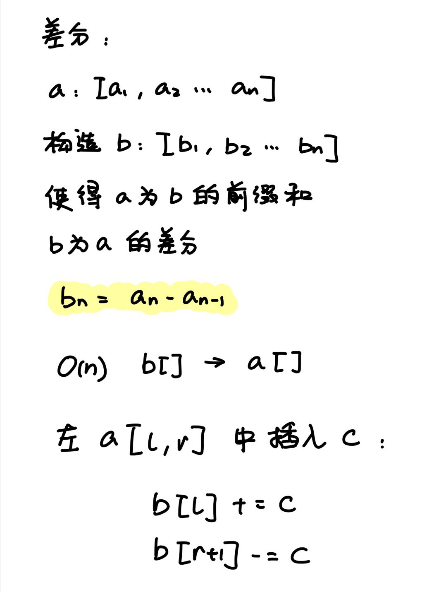
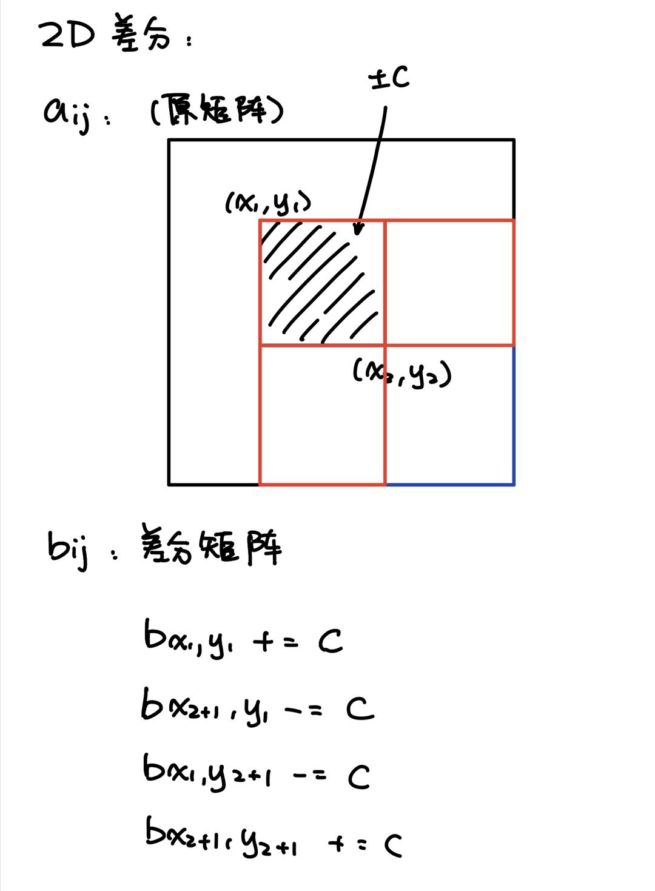

# 基础算法2

## 前缀和

### [1D Partial Sum](https://www.acwing.com/problem/content/797/)

原数组 [a1, a2, a3, ...]
前缀和 si = a1 + a2 + ... + si

求s[i] = s[i-1] + ai

s[0] = 0

```python
def main():
    size = str(input()).split(" ")
    length, q_num = int(size[0]), int(size[1])
    nums = [int(x) for x in str(input()).split(" ")]
    s = [0]
    for i in range(0, length):
        s.append(s[i] + nums[i])
    
    for i in range(0, q_num):
        q = [int(x) for x in str(input()).split(" ")]
        print(s[q[1]] - s[q[0]-1])

main()
```

### [2D Partial Sum](https://www.acwing.com/problem/content/798/)

)

```python
def main():
    # Get the input
    size_l = [int(x) for x in input().split(" ")]
    n, m, q = size_l[0], size_l[1], size_l[2]
    a = []
    for i in range(n):
        a.append([int(x) for x in input().split(" ")])
    questions = []
    for i in range(q):
        q_l = [int(x) for x in input().split(" ")]
        x1, y1, x2, y2 = q_l[0], q_l[1], q_l[2], q_l[3]
        questions.append([x1, y1, x2, y2])
    
    # Init s
    s = [[0 for _1 in range(m+1)] for _2 in range(n+1)]
    # Calculate s
    for i in range(1, n+1):
        for j in range(1, m+1):
            s[i][j] = s[i-1][j] + s[i][j-1] - s[i-1][j-1] + a[i-1][j-1]
    
    # Calculate the answer using s
    for question in questions:
        x1, y1, x2, y2 = question[0], question[1], question[2], question[3]
        print(s[x2][y2] - s[x2][y1-1] - s[x1-1][y2] + s[x1-1][y1-1])

main()
```

## 差分

### [1D 差分](https://www.acwing.com/problem/content/799/)



```python
def main():
    size_l = [int(x) for x in input().split(" ")]
    n, m = size_l[0], size_l[1]
    nums = [int(x) for x in input().split(" ")]
    
    b = []
    for i in range(n):
        if i == 0:
            b.append(nums[i])
        else:
            b.append(nums[i] - nums[i-1])
    
    for i in range(m):
        q = [int(x) for x in input().split(" ")]
        l, r, c = q[0], q[1], q[2]
        b[l-1] += c
        if not r >= len(b):
            b[r] -= c
    
    for i in range(1, len(b)):
        b[i] = b[i-1] + b[i]
    
    for res in b:
        print(res, end=" ")
    
main()
```

### [2D 差分](https://www.acwing.com/problem/content/800/)



```python
def insert(b, n, m, x1, y1, x2, y2, c):
    b[x1][y1] += c
    if x2+1 < n:
        b[x2+1][y1] -= c
    if y2+1 < m:
        b[x1][y2+1] -= c
    if x2+1<n and y2+1<m:
        b[x2+1][y2+1] += c

def main():
    size_l = [int(x) for x in input().split(" ")]
    n, m , q = size_l[0], size_l[1], size_l[2]
    
    a = []
    for i in range(n):
        a.append([int(x) for x in input().split(" ")])
    
    b = [[0 for _1 in range(m)] for _2 in range(n)]
    
    for i in range(n):
        for j in range(m):
            insert(b, n, m, i, j, i, j, a[i][j])
    
    for _ in range(q):
        question = [int(x) for x in input().split(" ")]
        x1, y1, x2, y2, c = question[0], question[1], question[2], question[3], question[4]
        insert(b, n, m, x1-1, y1-1, x2-1, y2-1, c)
    
    for i in range(n):
        for j in range(m):
            if i-1>=0:
                up = b[i-1][j]
            else:
                up = 0
            if j-1>=0:
                left = b[i][j-1]
            else:
                left = 0
            if i-1>=0 and j-1>=0:
                upLeft = b[i-1][j-1]
            else:
                upLeft = 0
            
            b[i][j] += up + left - upLeft
            print(b[i][j], end=" ")
        print()

main()
```