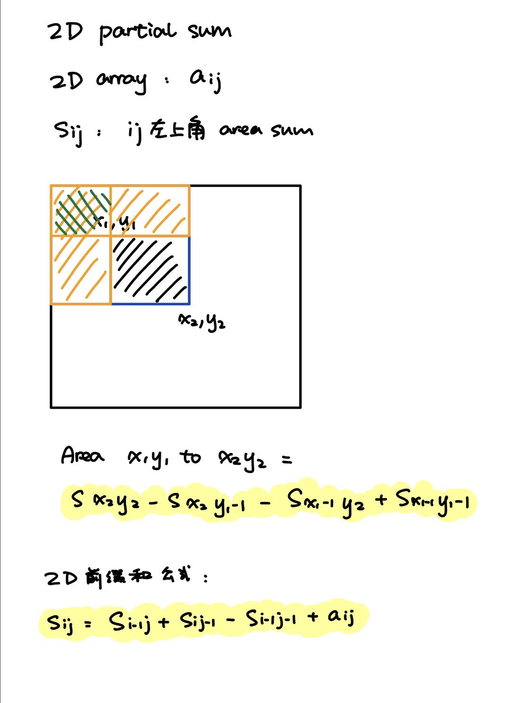

# 基础算法2

## 前缀和

### 1D Partial Sum

原数组 [a1, a2, a3, ...]
前缀和 si = a1 + a2 + ... + si

求s[i] = s[i-1] + ai

s[0] = 0

```python
def main():
    size = str(input()).split(" ")
    length, q_num = int(size[0]), int(size[1])
    nums = [int(x) for x in str(input()).split(" ")]
    s = [0]
    for i in range(0, length):
        s.append(s[i] + nums[i])
    
    for i in range(0, q_num):
        q = [int(x) for x in str(input()).split(" ")]
        print(s[q[1]] - s[q[0]-1])

main()
```

Link: [partial_sum](https://www.acwing.com/problem/content/797/)

### 2D Partial Sum

)

```python
def main():
    # Get the input
    size_l = [int(x) for x in input().split(" ")]
    n, m, q = size_l[0], size_l[1], size_l[2]
    a = []
    for i in range(n):
        a.append([int(x) for x in input().split(" ")])
    questions = []
    for i in range(q):
        q_l = [int(x) for x in input().split(" ")]
        x1, y1, x2, y2 = q_l[0], q_l[1], q_l[2], q_l[3]
        questions.append([x1, y1, x2, y2])
    
    # Init s
    s = [[0 for _1 in range(m+1)] for _2 in range(n+1)]
    # Calculate s
    for i in range(1, n+1):
        for j in range(1, m+1):
            s[i][j] = s[i-1][j] + s[i][j-1] - s[i-1][j-1] + a[i-1][j-1]
    
    # Calculate the answer using s
    for question in questions:
        x1, y1, x2, y2 = question[0], question[1], question[2], question[3]
        print(s[x2][y2] - s[x2][y1-1] - s[x1-1][y2] + s[x1-1][y1-1])

main()
```

## 差分