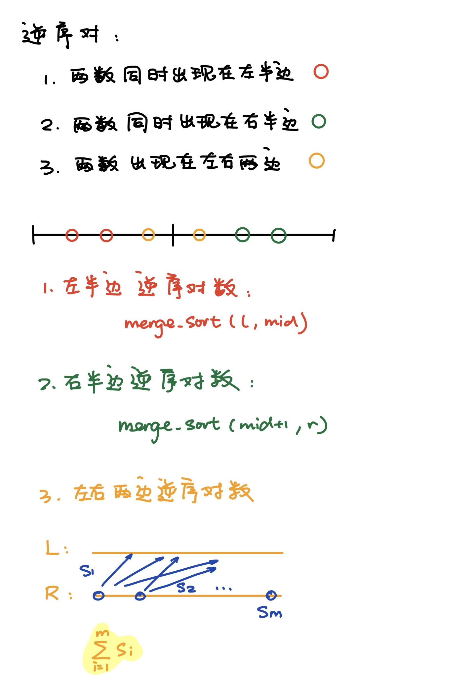
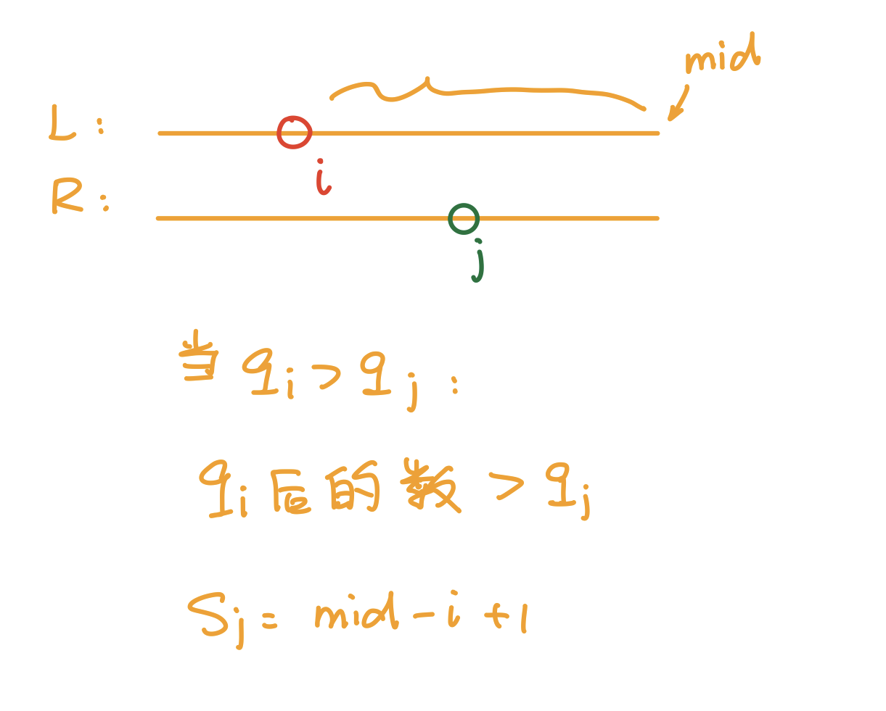

# 习题课

## [第K个数](https://www.acwing.com/problem/content/description/788/)

```python
def quick_sort(nums, l, r, target):
    if l == r:
        return nums[l]
    
    i, j = l-1, r+1
    p = nums[(l + r) // 2]
    while i < j:
        i += 1
        while nums[i] < p:
            i += 1
        j -= 1
        while nums[j] > p:
            j -= 1
            
        if i < j:
            nums[i], nums[j] = nums[j], nums[i]
    
    sl = j-l+1
    if target <= sl:
        return quick_sort(nums, l, j, target)
    else:
        return quick_sort(nums, j+1, r, target-sl)
    

def main():
    (n, k) = [int(x) for x in input().split(" ")]
    nums = [int(x) for x in input().split(" ")]
    print(quick_sort(nums, 0, n-1, k))

main()
```

## [逆序对](https://www.acwing.com/problem/content/790/)




```python
def merge_sort(nums, l, r):
    if l >= r:
        return 0
    
    mid = (l + r) // 2
    
    l_num = merge_sort(nums, l, mid)
    r_num = merge_sort(nums, mid+1, r)
    
    cross_num = 0
    
    tmp = []
    i, j = l, mid+1
    while i <= mid and j <= r:
        if nums[i] <= nums[j]:
            tmp.append(nums[i])
            i += 1
        else:
            tmp.append(nums[j])
            j += 1
            cross_num += mid - i + 1
    
    while i <= mid:
        tmp.append(nums[i])
        i += 1
    while j <= r:
        tmp.append(nums[j])
        j += 1
        
    for i in range(len(tmp)):
        nums[l+i] = tmp[i]
    
    return l_num + r_num + cross_num
    
def main():
    n = int(input())
    nums = [int(x) for x in input().split()]
    
    print(merge_sort(nums, 0, len(nums)-1))
    
main()
```

## [一维前缀和](https://www.acwing.com/problem/content/description/797/)

```python
def main():
    (n, m) = [int(x) for x in input().split()]
    nums = [int(x) for x in input().split()]
    questions = []
    for i in range(m):
        questions.append([int(x) for x in input().split()])
    
    s = [0]
    for i in range(n):
        s.append(s[i] + nums[i])
    
    for question in questions:
        print(s[question[1]] - s[question[0]-1])

main()
```

## [二维前缀和](https://www.acwing.com/problem/content/description/798/)
```python
def main():
    (n, m, q) = [int(x) for x in input().split()]
    a = []
    for i in range(n):
        a.append([int(x) for x in input().split()])
    questions = []
    for i in range(q):
        questions.append([int(x) for x in input().split()])
    
    s = [[0 for _1 in range(m+1)] for _2 in range(n+1)]
    for i in range(1, n+1):
        for j in range(1, m+1):
            s[i][j] = s[i][j-1] + s[i-1][j] - s[i-1][j-1] + a[i-1][j-1]
    
    for (x1, y1, x2, y2) in questions:
        print(s[x2][y2] - s[x1-1][y2] - s[x2][y1-1] + s[x1-1][y1-1])
    
main()
```