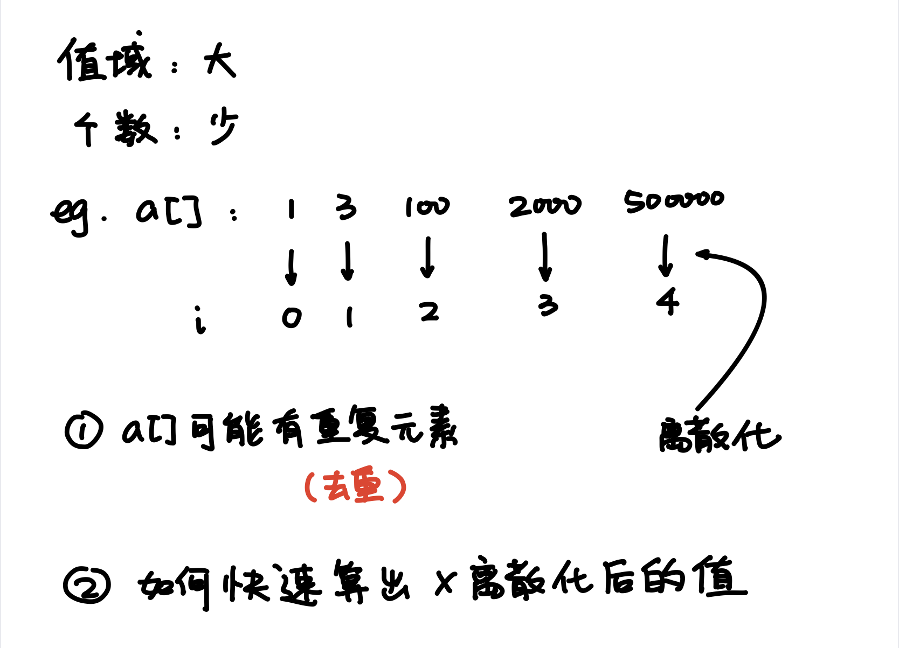

# 基础算法3

## 双指针

1. 两个数组的双指针（归并排序）
2. 单个数组的双指针（快排）

双指针算法的核心思想：
暴力循环：O(n^2)
双指针：O(n)

### [最长连续不重复子序列](https://www.acwing.com/problem/content/801/)

```python
def main():
    n = int(input())
    nums = [int(x) for x in input().split()]
    
    maxLen = 1
    
    for i in range(n-1):
        j = i
        while j + 1 < len(nums) and nums[j+1] != nums[j]:
            j += 1
        maxLen = max(maxLen, j-i+1)
        i = j
    
    print(maxLen)

main()
```

### [数组元素的目标和](https://www.acwing.com/problem/content/submission/code_detail/8696202/)

```python
def main():
    (n, m, x) = [int(x) for x in input().split()]
    a = [int(x) for x in input().split()]
    b = [int(x) for x in input().split()]
    i, j = n-1, 0
    while True:
        if a[i] + b[j] == x:
            print(i, j)
            return
        elif a[i] + b[j] > x:
            i -= 1
        else:
            j += 1

main()
```

## 位运算

### [二进制中1的个数](https://www.acwing.com/problem/content/submission/code_detail/8696198/)

```python
def lowbit(x):
    return x & -x

def main():
    n = int(input())
    nums = [int(x) for x in input().split()]
    
    for num in nums:
        res = 0
        while num != 0:
            res += 1
            num -= lowbit(num)
            
        print(res, end=" ")
        
main()
```

## 离散化



```python
def find(all, x):
    l, r = 0, len(all)-1
    while l < r:
        mid = (l + r) // 2
        if all[mid] >= x:
            r = mid
        else:
            l = mid + 1
    return l + 1

def main():
    (n, m) = [int(x) for x in input().split()]
    all = []
    # a[0] = 0
    a = [0]
    s = [0]
    add = []
    for i in range(n):
        (x, c) = [int(x) for x in input().split()]
        add.append((x, c))
        all.append(x)
        a.append(0)
        s.append(0)
    questions = []
    for i in range(m):
        (l, r) = [int(x) for x in input().split()]
        questions.append((l, r))
        all.append(l)
        all.append(r)
        a.append(0)
        a.append(0)
        s.append(0)
        s.append(0)
    
    # Discretization
    all = list(set(all))
    all.sort()
    
    for (x, c) in add:
        index = find(all, x)
        a[index] += c
    
    # Calculate prefix
    for i in range(1, len(a)):
        s[i] = s[i-1] + a[i]
    
    # Process questions
    for (l, r) in questions:
        l_index = find(all, l)
        r_index = find(all, r)
        print(s[r_index] - s[l_index-1])

main()
```

## 区间合并

1. 按照区间的左端点排序
2. 扫描所有的区间， 把可合并的区间合并

```python
def quick_sort(nums, l, r):
    if l >= r:
        return
    
    i, j = l-1, r+1
    p = nums[(l + r) // 2][0]
    
    while i < j:
        i += 1
        while nums[i][0] < p:
            i += 1
        
        j -= 1
        while nums[j][0] > p:
             j -= 1
        
        if i < j:
            nums[i], nums[j] = nums[j], nums[i]
    
    quick_sort(nums, l, j)
    quick_sort(nums, j+1, r)

def main():
    n = int(input())
    nums = []
    for i in range(n):
        nums.append([int(x) for x in input().split()])
        
    # Sort all the ranges
    quick_sort(nums, 0, len(nums)-1)
    
    res = 1
    working = nums[0]
    for num in nums:
        if num[0] <= working[1]:
            working[1] = max(num[1], working[1])
        else:
            working = num
            res += 1
    
    print(res)
    
main()
```